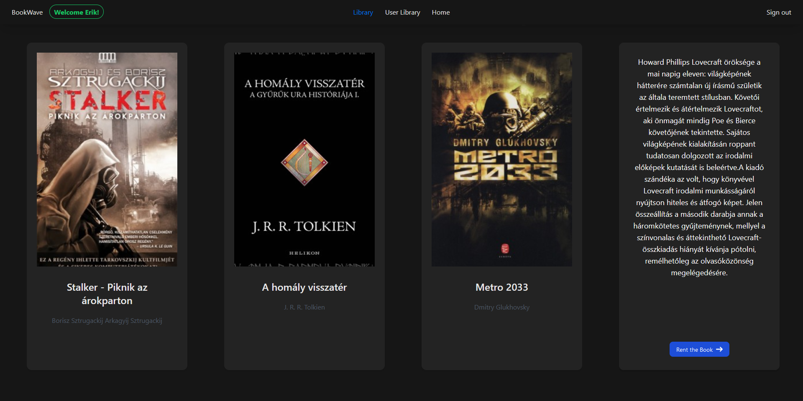

# BookWave

BookWave is a simple book rental application built with Spring Boot for the backend and featuring a sleek and intuitive frontend design using Tailwind CSS and Ripple UI. 
## Features

    Browse and explore a wide selection of available books.
    Convenient book rental process.
    User-friendly interfaces for an effortless experience.
    Admin capabilities for book management and user administration.
    Search for books by genre, author, or title.

